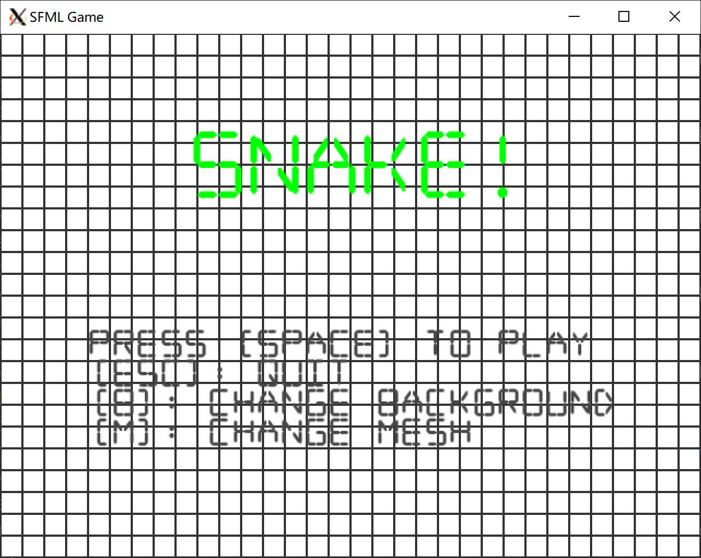
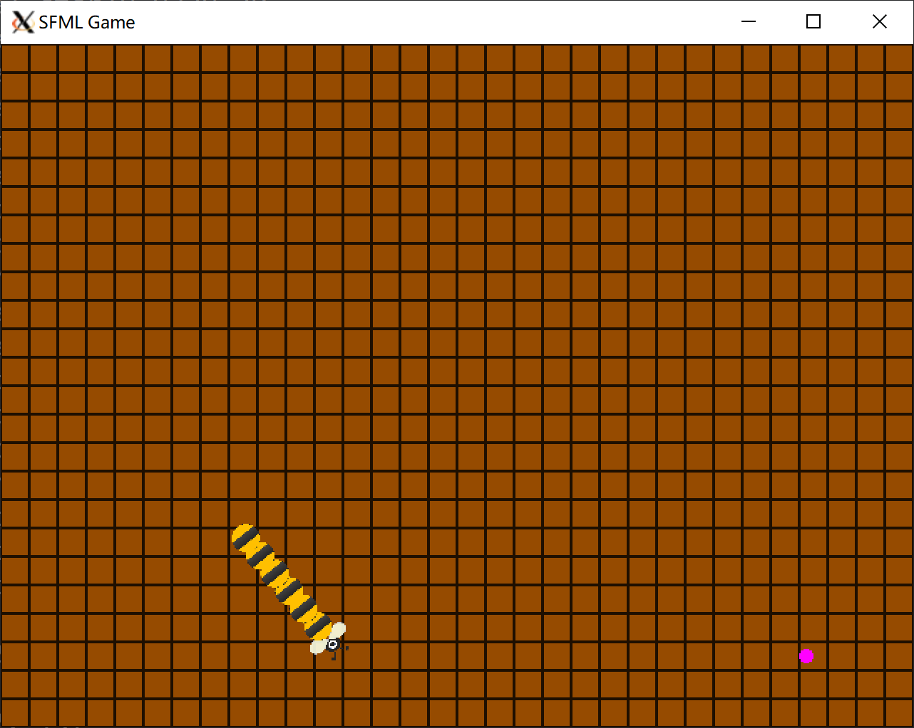
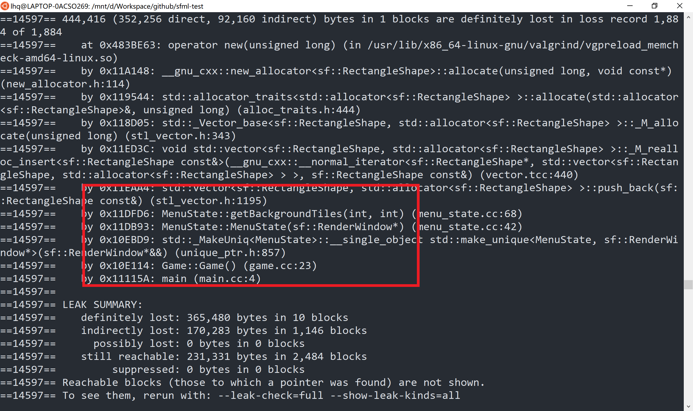

# OOP期末大作业: SFML Snake

## 1 编译环境

操作系统：Ubuntu 20.04 LTS（Linux）

编译运行：在Ubuntu上用命令`sudo apt install libsfml-dev`安装SFML库后，运行`make run`后即可运行

## 2 框架设计

由于[原项目](https://github.com/jhpy1024/sfSnake)的文件结构过于扁平，而实际项目开发中，我们需要一个更加层次分明的项目架构，且原先的代码框架缺少一些诸如状态管理器、资源管理器的部件，于是我干脆对原代码进行了重构，重新编排了文件布局，并加入了状态控制机制（见 `src/game` 和 `src/states/state`），全局的资源管理器单例（见`src/resource`），

### 2.2 代码风格

在重构过程中，尽量向[谷歌c++风格指南](https://google.github.io/styleguide/cppguide.html)靠齐，也借此机会学习更加规范的c++代码风格。

### 2.3 状态管理器

相关文件：`src/game`、`src/states/state`

容易发现，原项目是通过直接赋值 `Game::Screen` 来完成状态切换的，这种方式有如下两个弊端：

1. 无法保存当前状态，仅能切换，而在游戏中，状态的各种操作如新增、切换、退出都很常见，比如在游戏界面中打开的设置界面。
2. 难以优雅地完成状态转变，在状态切换的逻辑越来越复杂的时候，为了代码的可读性，通常需要将状态操作相关的逻辑从游戏逻辑中剖离开来，以提高项目的模块化程度和可维护性

于是在重构的过程中，同许多游戏引擎类似，我加入了一个简单的状态管理器。

对于第一个问题，我们可以发现游戏中状态的转变和栈的操作push/pop类似，而当前状态恰好是栈顶，如新增一个状态可以转化为push一个新状态，切换一个状态可以为先pop掉栈顶（当前状态）再push新状态，状态的退出则是直接pop即可。再配合上`std::unique_ptr`，栈上元素就是一个状态实例的智能指针，pop掉后，引用计数为零，自动完成状态的销毁。

对于第二个问题，为了可控（便于debug），每个状态在下一帧的动作仅仅取决于其状态码和next指针（下一个状态），于是可以将状态的行为总结如下表：

| 状态码  | next指针   | 行为解释               |
| ------- | ---------- | ---------------------- |
| RUNNING | 必须为空   | 继续当前状态           |
| PAUSE   | 必须非空   | 打开新状态             |
| EXIT    | 为空或非空 | 为空为退出，非空为切换 |

### 2.4 资源管理器

相关文件：`src/resource`

为了更好的复用各种`sf::Texture`和`sf::Font`，我采用一个全局的资源管理器来完成资源共享。实现的方式为引用计数，当需要使用某个资源的时候，就显示的申请，释放时也需显示释放。而由于资源管理器是全局的（因为需要维护共享信息），而面向对象式的项目又不推荐全局变量，于是我将这个类写成了单例。

## 3. 功能

### 3.1 贪食蛇的控制

相关文件：`src/objects/snake`

在源代码的基础上，添加鼠标控制。在实现时踩过一个坑：SFML中获取鼠标的位置是相对于windows的，而SFML中`getPosition`所得坐标是在其内部渲染坐标上的，于是我们需要用 `mapPixelToCoords` 转换一下，否则窗口缩放后，得到的坐标会有所偏差。

### 3.2 水果的控制

相关文件：`src/states/game_state.cc`

概率分布使用$[0, 7]$的均匀分布的整数来控制即可

### 3.3 贪食蛇Sprite

相关文件：`src/objects/snake_node`，`assets/textures/snake_body.png`，`assets/textures/snake_head.png`

自行绘制图片然后用sprite实现即可

注：因为考虑到用矩形和圆形来显示节点可能效果不是很好（矩形和圆形无法吻合），于是都改用了sprite来实现。

### 3.4 界面修改

相关文件：`src/states/menu_state`

在菜单界面中按b键切换背景，按m键切换网格。网格和背景可以通过渲染一个一个小正方形来完成，网格颜色就是正方形的outline，背景就是fillColor，然后在所有渲染之前完成这些正方形的渲染即可

下图为白色背景、黑色网格的菜单界面和棕色背景、黑色网格的游戏界面

    
    

### 3.5 清理代码

#### SFML资源优化

在SFML中，`sf::Texture`/`sf::Font`都被是视作一种资源，且在本项目中是只读的（更确切地说，在调用到的地方都是常引用）。在引入了资源管理器后，实现了资源共享，相同的资源只会在内存中存放一份，于是提高了内存利用率。

#### 内存泄漏检测

内存泄漏问题是一个很常见也很重要的软件问题，常常发生于底层直接操作内存的时候。当我们向操作系统申请了内存而未及时释放，就会发生内存泄漏。在c语言中，我们必须调用`free`函数来手动完成资源的释放，而在一些高级语言中，通常使用[垃圾回收](https://en.wikipedia.org/wiki/Garbage_collection_(computer_science))机制来避免这种问题。对于c++，同样有智能指针来避免这个问题，但事实上，在使用智能指针的过程中，同样需要谨慎，尤其是涉及到子类父类的释放的情况。

在实现过程，我使用了[valgrind](https://www.valgrind.org/)——一个功能强大的内存测试工具，来监测内存泄漏。而且在Ubuntu上安装也异常简便，`sudo apt install valgrind`即可，我所使用的命令已经集成在 `Makefile` 里了，`make test-mem`。为了检验其功能，我尝试将`src/states/state.h`中的析构函数的 virtual 去掉（这个是`src/states/xxx_state` 的基类，不写virtual则析构时不会调用派生类的构造函数），然后用valgrind果然检测出了内存泄漏，如下图。（虽然看不太懂，但大致是出现了内存泄漏），加上virtual就不会报这些错误了。

### 3.6 其他

修复一些原项目的bug

1. 水果总是出现在同一行
2. 使用了一些deprecated的SFML函数

## 4 总结

总而言之，相比于原项目，除了游戏功能要求之外，我进行了如下工作：

- 重构代码结构（Makefile、文件结构）
- 实现资源管理器来优化复用共享资源
- 实现状态管理器来进行状态界面的统一调度（退出和切换）
- 用 valgrind 验证程序的内存泄漏情况
